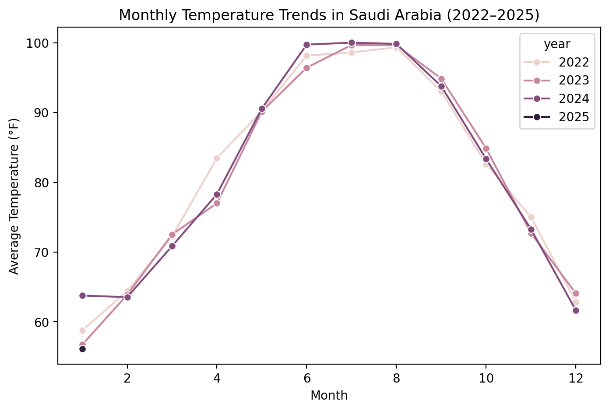
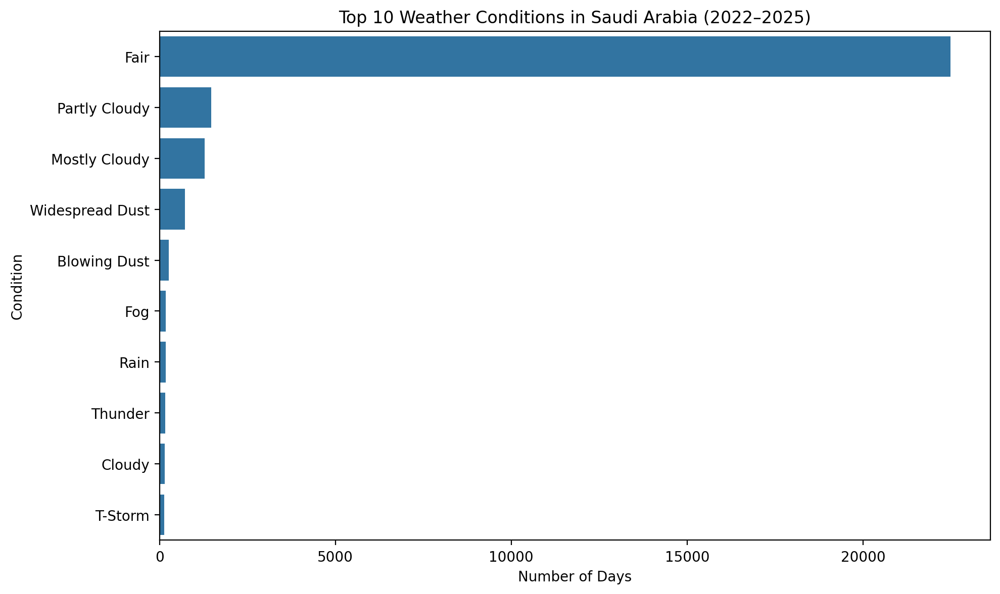
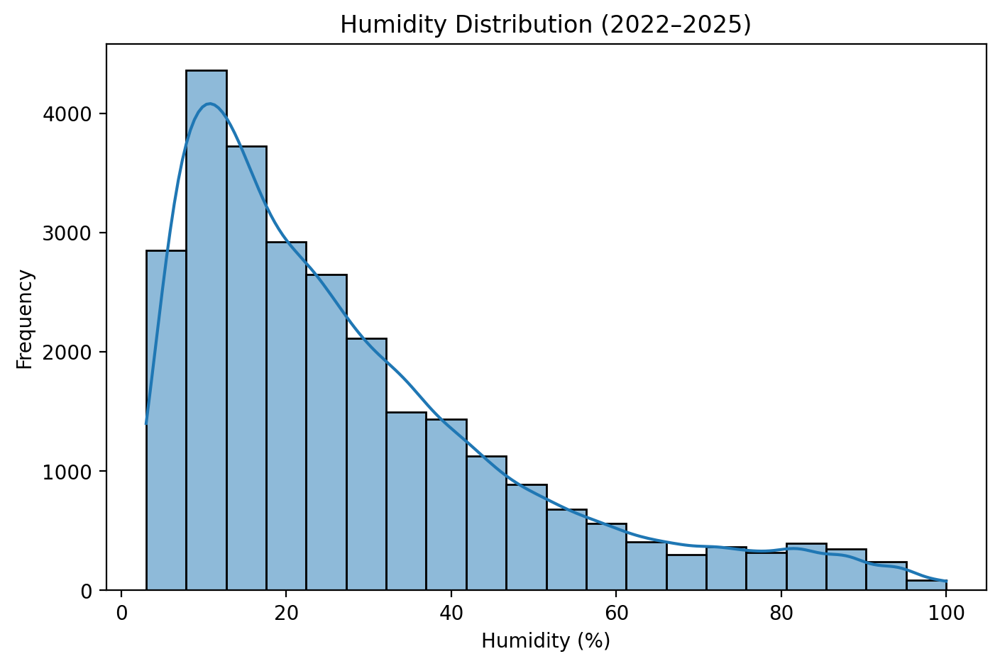

# Weather Data Analysis (Saudi Arabia, 2022–2025)

This project analyzes weather data in Saudi Arabia (2022–2025).  
It includes **data cleaning, exploratory data analysis (EDA), and visualizations**.

## Steps
1. Data Loading  
2. Data Cleaning (Temperature, Humidity, Precipitation)  
3. EDA (monthly averages, weather conditions)  
4. Visualizations  

## Results
- Most days are classified as **Fair (~80%)**.  
- Clear seasonality in temperatures (hot summers, cooler winters).  
- Precipitation values were always `0.0` in this dataset.  

## Figures
  
  

---
Made with **Python, Pandas, Matplotlib, Seaborn**.
